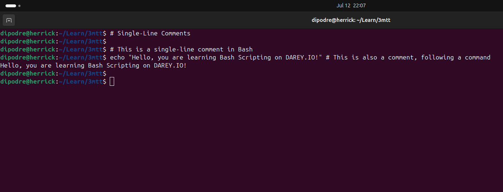
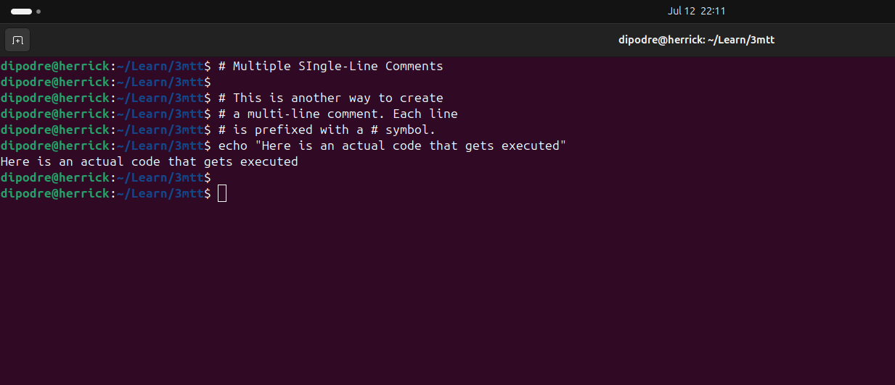

<!-- ABOUT THE PROJECT -->
## LINUX SHELL SCRIPTING (COMMENTS)

### Objective

For this project, the following steps were taken to demonstrate shell scripting in linux:

- [LINUX SHELL SCRIPTING (COMMENTS)](#linux-shell-scripting-comments)
  - [Objective](#objective)
    - [Shell Scripting](#shell-scripting)
    - [Comments In Shell Scripting](#comments-in-shell-scripting)
    - [Single-Line Comments](#single-line-comments)
    - [Best Practices for Comments](#best-practices-for-comments)

----

#### Shell Scripting

It is the process of writing and executing a series of instructions in a shell.
It is used to automate tasks.

#### Comments In Shell Scripting

Comments are lines in a shell script that are ignored by the shell.
They are used to explain what the script does, and are useful for debugging.
They help with communication between team and code maintenance.

----

#### Single-Line Comments

In bash, you can use the **#** symbol to start a single-line comment.

Example using a multiple single-line comment.

----

#### Best Practices for Comments

- Write clear and concise comments.
- Keep comments updated.
- Use comments to explain complex code.
- Avoid commenting on simple code.

----

